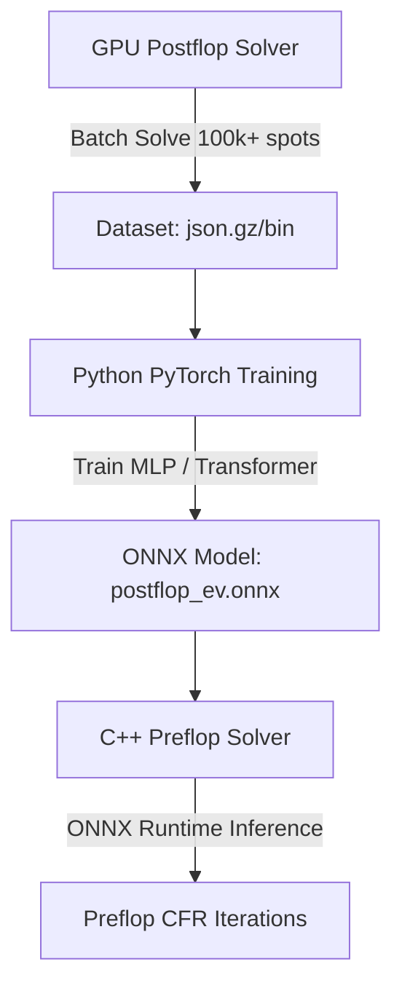
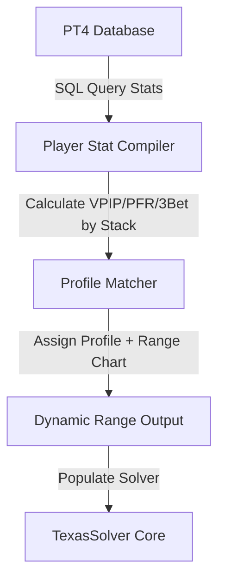

# TexasSolver Architectural Plan & Implementation Guide

This document outlines the architectural design and step-by-step implementation plan for the next phase of **TexasSolver** development. It is structured to serve as an explicit guide for future AI agents or developers to execute.

---

## 1. GPU Solver Speed Optimizations

### Current Bottlenecks
1. **Sleep-based Throttling**: The solver calls `std::this_thread::sleep_for(std::chrono::milliseconds(2))` every 5 iterations. For high-speed GPU solves, this adds a static ~0.4ms overhead per iteration, which can account for 50%+ of iteration time.
2. **Sequential Tree Traversal**: The CUDA/HIP kernels loop sequentially through all states:
   ```cpp
   for (int state_idx = 0; state_idx < num_states; ++state_idx)
   ```
   Although parent-to-child data dependencies exist, states at the same tree depth (BFS level) are independent and can be processed in parallel.
3. **Slow CPU-based Exploitability Calculation**: Early stopping checks copy all strategies to the CPU and calculate exploitability every 40 iterations. The CPU-side Best Response walking is single-threaded or slow compared to GPU compute.

### Proposed Architecture

#### A. Throttling and Synchronize Controls
- Make the heartbeat sleep interval configurable via the UI/config (default to no sleep, or a yield every 100 iterations).
- Only call `hipDeviceSynchronize()` when checking early-stopping or updating the UI progress bar.

#### B. BFS Level-by-Level Kernel Dispatching
- Sort and group `h_states` by tree depth (levels). 
- Replace the giant sequential loop with level-by-level kernel launches. 
- During `buildGpuStates()`, identify the list of states belonging to each level:
  ```cpp
  std::vector<std::vector<int>> level_state_indices; // levels -> list of state indices
  ```
- Dispatch a kernel launch for each level. The GPU threads will process all states in that level and all combos in parallel.

#### C. Optimized CPU/GPU Best Response
- Increase early-stopping check intervals from `40` to `100` or `200` iterations (configurable).
- Parallelize the CPU `BestResponse::exploitability` calculation using OpenMP across the card combinations.

---

## 2. GPU VRAM Optimizations

### Current Bottlenecks
- `d_reach_probs` and `d_utilities` are allocated as:
  ```cpp
  size_t reach_probs_bytes = h_states.size() * (range1_size + range2_size) * sizeof(float);
  ```
  For 100k states and full ranges (1326 combos), this requires ~1.06 GB of VRAM *each*, totaling over 2 GB of VRAM just for transient reach/utility buffers.

### Proposed Architecture

#### A. FP16 Transition for Reach Probs & Utilities
- Transition `d_reach_probs` and `d_utilities` to `__half` (FP16).
- Reach probabilities are bounded in `[0.0, 1.0]`, and utility scales with pot sizes, making them excellent candidates for half-precision float values.
- **VRAM Savings**: Instantly reduces VRAM footprint by **50%** for these buffers (saving ~1GB on larger trees).

#### B. Active Path Stack / Ring Buffer (Frontier Processing)
- Because CFR is a BFS top-down / bottom-up traversal, we do not need to store reach probabilities for the entire tree simultaneously.
- We only need to store reach probabilities for the *current level* and the *next level* during the forward pass.
- We can allocate a ping-pong buffer of size `2 * max_level_width * total_combos * sizeof(float)` instead of the full tree size.

---

## 3. Neural Network Preflop Solver Integration

### Background
Preflop solvers require massive RAM (typically 32GB to 256GB+) because the postflop trees for all possible boards must be represented.
We can replace the postflop subtrees with a Neural Network (NN) estimator:
```
NN(OOP_Range, IP_Range, Board, Pot, Stack) -> (EV_OOP, EV_IP)
```

### Proposed Architecture



### Implementation Steps
1. **Batch Solve Script**: Write a Python script that generates random ranges, boards, pot sizes, and stack sizes, calls `TexasSolver` CLI to solve them, and saves the GTO solves.
2. **Model Architecture**: Train a PyTorch neural network to predict the EV of each combo in the range based on the board features (card ranks, suits, textures) and range weights.
3. **Export to ONNX**: Export the trained PyTorch model to `.onnx`.
4. **ONNX Runtime in C++**: Link `onnxruntime` or `libtorch` to the C++ TexasSolver.
5. **NN Preflop Solver**: Modify the Preflop Solver to bypass postflop tree construction and directly query the ONNX model at the flop transition node.

---

## 4. Hand Evaluation Metadata & Leak Finder

### Goal
Evaluate the user's actual play in hands imported from PokerTracker 4 against GTO recommendations, tracking EV loss and deviations.

### Proposed Architecture
1. **Solve Current Hand**: When a hand is imported and solved, the GTO strategy explorer calculates GTO EVs for every action.
2. **Metadata Extraction**: For each decision point where the player acted:
   - Identify the user's chosen action (e.g., check, bet size).
   - Find the EV of the chosen action from the solved tree.
   - Find the maximum EV action (`Max_EV`).
   - Calculate EV Loss: `EV_Loss = Max_EV - Chosen_EV`.
3. **Database Logging**: Save this comparison data into a local SQLite database table:
   ```sql
   CREATE TABLE player_gto_decisions (
       id INTEGER PRIMARY KEY AUTOINCREMENT,
       hand_no TEXT,
       street TEXT, -- Flop, Turn, River
       player_name TEXT,
       board TEXT,
       action_chosen TEXT,
       gto_action_recommended TEXT,
       ev_chosen REAL,
       ev_max REAL,
       ev_loss REAL,
       pot_size REAL,
       effective_stack REAL
   );
   ```
4. **UI Dashboard**: Build a "Leak Finder" window in Qt that reads this table and displays statistics:
   - Total EV Loss by street (Flop, Turn, River).
   - Biggest blunders (highest EV loss hands).
   - EV loss by hand type (e.g., top pair, flush draw).

---

## 5. Dynamic Player Profiling & Range Bucketing

### Goal
Define player profiles and dynamically adjust their preflop/postflop ranges based on PT4 stats, controlled by stack sizes and tournament stages.

### Proposed Architecture



### Implementation Details
Query the PT4 database for the target opponent's stats grouped by stack sizes:
```sql
SELECT 
    sum(case when stat.amt_before / summary.amt_bb < 15 then 1 else 0 end) as hands_short,
    sum(case when stat.amt_before / summary.amt_bb >= 15 and stat.amt_before / summary.amt_bb < 30 then 1 else 0 end) as hands_medium,
    -- Calculate VPIP, PFR, 3Bet for each stack size bracket
    ...
FROM tourney_hand_player_statistics stat
JOIN tourney_hand_summary summary ON stat.id_hand = summary.id_hand
WHERE stat.id_player = (SELECT id_player FROM player WHERE player_name = :name);
```

1. **Profile Buckets**: Define buckets based on stats:
   - **Calling Station**: High VPIP, Low PFR, Low 3Bet.
   - **Nit**: Low VPIP, Low PFR.
   - **TAG**: Medium VPIP, Medium PFR, High 3Bet.
   - **Maniac**: High VPIP, High PFR, High 3Bet.
2. **Dynamic Range Generator**: Map these stats directly to ranges. If an opponent has a 12% PFR at 15-30bb, build their raising range using the top 12% of hands adjusted for tournament structure (e.g., wider from BTN, tighter from UTG).
3. **Automation**: When importing a hand from PT4, query the SQL database for the active player's stats in that specific stack size bracket, match their profile, and automatically construct and inject their range into the solver.

---

## 6. Local SQLite Solver Database Schema

### Goal
Remove file-based clutter and make solves portable by saving configurations, metadata, and solves to a SQLite database.

### Proposed Schema

```sql
-- Main Table for Hand Solves
CREATE TABLE solves (
    id_solve INTEGER PRIMARY KEY AUTOINCREMENT,
    hand_no TEXT UNIQUE,
    board TEXT,
    pot REAL,
    effective_stack REAL,
    ip_player TEXT,
    oop_player TEXT,
    ip_range_str TEXT,
    oop_range_str TEXT,
    exploitability REAL,
    iterations INTEGER,
    date_solved DATETIME DEFAULT CURRENT_TIMESTAMP,
    solve_blob BLOB -- Compressed binary solve data (gzip TXSB format)
);

-- Table for Bet Sizing Tree Templates
CREATE TABLE tree_templates (
    id_template INTEGER PRIMARY KEY AUTOINCREMENT,
    name TEXT,
    flop_ip_bet TEXT,
    flop_oop_bet TEXT,
    turn_ip_bet TEXT,
    turn_oop_bet TEXT,
    river_ip_bet TEXT,
    river_oop_bet TEXT,
    allin_threshold REAL
);
```

### UI Integration
- Add a "Solve History Database" panel to the Main Window.
- Allow users to filter solves by: board cards, date, player names, stack sizes, or exploitability.
- Double-clicking a database row automatically loads the config, builds the tree, unpacks the GTO strategies from the BLOB, and opens the Strategy Explorer.

---

## 7. Action Item / Checklist for Gemini Flash

- [ ] **Phase 1: GPU Solver Acceleration**
  - [ ] Implement `level_state_indices` compilation in `HipPCfrSolver::buildGpuStates()`.
  - [ ] Rewrite `hip_launch_forward_pass` and `hip_launch_backward_pass` to launch level-by-level instead of sequential looping.
  - [ ] Add a checkbox to the UI to enable/disable the 2ms sleep throttling.
- [ ] **Phase 2: VRAM Reductions**
  - [ ] Add FP16 conversion for `d_reach_probs` and `d_utilities` buffers.
  - [ ] Modify kernels to cast/read/write values in FP16.
- [ ] **Phase 3: PT4 Dynamic Profiles**
  - [ ] Add SQL queries to `pt4importdialog.cpp` to look up player VPIP/PFR stats by stack size.
  - [ ] Implement range chart generator based on lookup stats.
- [ ] **Phase 4: SQLite Integration**
  - [ ] Integrate SQLite into the main window.
  - [ ] Implement database saving/loading of solves.
