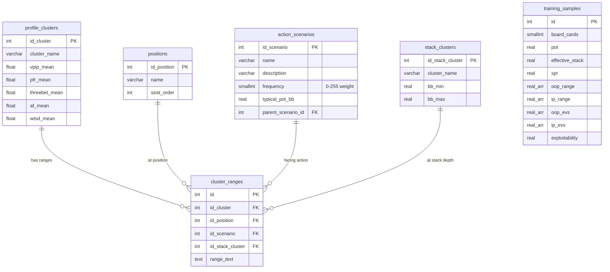

# Neural Network Training Pipeline — Revised Plan v4

---

## Database Schema



---

### `positions` — 9 rows

```sql
CREATE TABLE IF NOT EXISTS positions (
    id_position SERIAL PRIMARY KEY,
    name VARCHAR(10) UNIQUE NOT NULL,
    seat_order INT NOT NULL
);

INSERT INTO positions (name, seat_order) VALUES
    ('UTG', 1), ('UTG1', 2), ('MP', 3), ('MP1', 4), ('HJ', 5),
    ('CO', 6), ('BTN', 7), ('SB', 8), ('BB', 9)
ON CONFLICT (name) DO NOTHING;
```

---

### `action_scenarios` — 30 rows

The `frequency` column (0-255) weights how often this scenario occurs in real games. The batch generator uses this for weighted random sampling — it'll generate 17× more RFI solves than vs_5bet solves.

The `typical_pot_bb` column gives the expected postflop pot size for that scenario assuming standard raise sizing. The batch generator adds ±15% random noise around this value.

```sql
CREATE TABLE IF NOT EXISTS action_scenarios (
    id_scenario SERIAL PRIMARY KEY,
    name VARCHAR(40) UNIQUE NOT NULL,
    description TEXT,
    frequency SMALLINT NOT NULL DEFAULT 128,   -- 0-255, higher = more common
    typical_pot_bb REAL NOT NULL DEFAULT 6.5,   -- expected pot at flop in BB
    parent_scenario_id INT REFERENCES action_scenarios(id_scenario)
);
```

**Full scenario catalogue:**

#### Open Action (no prior voluntary action)

| # | name | description | freq | pot_bb | parent |
|---|------|-------------|------|--------|--------|
| 1 | `RFI` | Raise First In — no one entered the pot | 255 | 6.5 | — |
| 2 | `open_limp` | Open limp — no one entered the pot | 80 | 4.0 | — |

#### Facing Limper(s)

| # | name | description | freq | pot_bb | parent |
|---|------|-------------|------|--------|--------|
| 3 | `vs_1limp_raise` | 1 limper, you isolate raise | 120 | 8.5 | `open_limp` |
| 4 | `vs_1limp_call` | 1 limper, you overcall | 100 | 5.0 | `open_limp` |
| 5 | `vs_2limp_raise` | 2 limpers, you isolate raise | 60 | 11.0 | `open_limp` |
| 6 | `vs_2limp_call` | 2 limpers, you overcall | 70 | 6.0 | `open_limp` |
| 7 | `vs_3plus_limp_raise` | 3+ limpers, you isolate raise | 30 | 14.0 | `open_limp` |
| 8 | `vs_3plus_limp_call` | 3+ limpers, you overcall | 50 | 7.5 | `open_limp` |

#### Facing an Open Raise (PFR)

| # | name | description | freq | pot_bb | parent |
|---|------|-------------|------|--------|--------|
| 9 | `vs_pfr_call` | Cold call the open raise | 200 | 6.5 | `RFI` |
| 10 | `vs_pfr_3bet` | 3-bet the open raiser | 150 | 22.0 | `RFI` |

#### Squeeze Spots (Raise + Caller(s) Already In)

| # | name | description | freq | pot_bb | parent |
|---|------|-------------|------|--------|--------|
| 11 | `vs_pfr_1caller_call` | Raise + 1 cold caller, you flat | 90 | 9.0 | `RFI` |
| 12 | `vs_pfr_1caller_squeeze` | Raise + 1 cold caller, you squeeze (3-bet) | 50 | 25.0 | `RFI` |
| 13 | `vs_pfr_2plus_callers_call` | Raise + 2+ callers, you flat | 40 | 12.0 | `RFI` |
| 14 | `vs_pfr_2plus_callers_squeeze` | Raise + 2+ callers, you squeeze | 25 | 28.0 | `RFI` |

#### Facing a 3-Bet (You Were the Original Raiser)

| # | name | description | freq | pot_bb | parent |
|---|------|-------------|------|--------|--------|
| 15 | `vs_3bet_call` | You opened, got 3-bet, you flat | 100 | 22.0 | `vs_pfr_3bet` |
| 16 | `vs_3bet_4bet` | You opened, got 3-bet, you 4-bet | 60 | 45.0 | `vs_pfr_3bet` |

#### Facing a 3-Bet (Cold — You Were NOT the Raiser)

| # | name | description | freq | pot_bb | parent |
|---|------|-------------|------|--------|--------|
| 17 | `vs_3bet_cold_call` | Someone raised, someone 3-bet, you cold-call the 3-bet | 35 | 24.0 | `vs_pfr_3bet` |
| 18 | `vs_3bet_cold_4bet` | Someone raised, someone 3-bet, you cold 4-bet | 10 | 48.0 | `vs_pfr_3bet` |

#### Facing a 4-Bet

| # | name | description | freq | pot_bb | parent |
|---|------|-------------|------|--------|--------|
| 19 | `vs_4bet_call` | Facing a 4-bet, you call | 30 | 45.0 | `vs_3bet_4bet` |
| 20 | `vs_4bet_5bet` | Facing a 4-bet, you 5-bet/shove | 15 | all-in | `vs_3bet_4bet` |

#### Facing a 5-Bet / All-In

| # | name | description | freq | pot_bb | parent |
|---|------|-------------|------|--------|--------|
| 21 | `vs_5bet_call` | Facing a 5-bet/shove, you call | 15 | all-in | `vs_4bet_5bet` |

#### Limp-Reraise Trap (You Limped, Someone Raised Behind)

| # | name | description | freq | pot_bb | parent |
|---|------|-------------|------|--------|--------|
| 22 | `limp_vs_raise_call` | You limped, someone raised, you call | 60 | 8.0 | `open_limp` |
| 23 | `limp_vs_raise_reraise` | You limped, someone raised, you limp-reraise | 20 | 24.0 | `open_limp` |

#### Raise Over Limpers (Someone Limped, Someone Else Raised)

| # | name | description | freq | pot_bb | parent |
|---|------|-------------|------|--------|--------|
| 24 | `vs_limp_raise_call` | Limper(s) + raiser, you cold call | 50 | 9.0 | `vs_1limp_raise` |
| 25 | `vs_limp_raise_3bet` | Limper(s) + raiser, you 3-bet | 25 | 24.0 | `vs_1limp_raise` |

#### BB-Specific Actions

| # | name | description | freq | pot_bb | parent |
|---|------|-------------|------|--------|--------|
| 26 | `BB_defend_call` | BB defends vs single raise (flat) | 180 | 6.5 | `RFI` |
| 27 | `BB_defend_3bet` | BB 3-bets vs single raise | 80 | 22.0 | `RFI` |
| 28 | `BB_check_vs_limpers` | BB checks behind limpers (free flop) | 100 | 4.0 | `open_limp` |
| 29 | `BB_raise_vs_limpers` | BB raises the limpers | 60 | 10.0 | `open_limp` |

#### SB-Specific Actions

| # | name | description | freq | pot_bb | parent |
|---|------|-------------|------|--------|--------|
| 30 | `SB_complete` | SB completes/limps into BB | 40 | 3.0 | — |

> [!NOTE]
> **`typical_pot_bb` explained**: This is the expected pot at the start of postflop play for that scenario, assuming standard 2.5x open, ~3x 3-bet, ~2.2x 4-bet sizing. For all-in pots (vs_4bet_5bet, vs_5bet_call), the batch generator will use `2 × effective_stack` as the pot. The generator adds ±15% noise to these values to create variety.

> [!TIP]
> **Frequency usage**: The batch generator normalizes all frequencies to probabilities: `P(scenario) = freq / sum(all_freqs)`. With the values above, RFI gets sampled ~10% of the time, vs_3bet_cold_4bet gets sampled ~0.4% of the time. Over 5,000 solves, you'd get ~500 RFI solves but only ~20 cold-4bet solves — matching real poker.

---

### `stack_clusters` — 5 rows (updated ranges)

```sql
CREATE TABLE IF NOT EXISTS stack_clusters (
    id_stack_cluster SERIAL PRIMARY KEY,
    cluster_name VARCHAR(50) UNIQUE NOT NULL,
    bb_min REAL NOT NULL,
    bb_max REAL NOT NULL
);

INSERT INTO stack_clusters (cluster_name, bb_min, bb_max) VALUES
    ('Ultra-Short (0-8 BB)',    0.0,   8.0),
    ('Short (8-20 BB)',         8.0,  20.0),
    ('Medium (20-35 BB)',      20.0,  35.0),
    ('Standard (35-60 BB)',    35.0,  60.0),
    ('Deep (60-100+ BB)',      60.0, 200.0)
ON CONFLICT (cluster_name) DO NOTHING;
```

---

### `cluster_ranges` — The data table

```sql
CREATE TABLE IF NOT EXISTS cluster_ranges (
    id SERIAL PRIMARY KEY,
    id_cluster INT NOT NULL REFERENCES profile_clusters(id_cluster) ON DELETE CASCADE,
    id_position INT NOT NULL REFERENCES positions(id_position),
    id_scenario INT NOT NULL REFERENCES action_scenarios(id_scenario),
    id_stack_cluster INT NOT NULL REFERENCES stack_clusters(id_stack_cluster),
    range_text TEXT NOT NULL,
    UNIQUE(id_cluster, id_position, id_scenario, id_stack_cluster)
);
```

**Row count**: ~5,000-6,000 valid combinations (many position/scenario combos are impossible — UTG can't face `BB_defend_call`, BB can't `RFI` from BTN, etc.)

---

### `training_samples` — Solve output

```sql
CREATE TABLE IF NOT EXISTS training_samples (
    id SERIAL PRIMARY KEY,
    board_card0 SMALLINT NOT NULL,
    board_card1 SMALLINT NOT NULL,
    board_card2 SMALLINT NOT NULL,
    pot REAL NOT NULL,
    effective_stack REAL NOT NULL,
    spr REAL NOT NULL,
    oop_range REAL[] NOT NULL,
    ip_range REAL[] NOT NULL,
    oop_evs REAL[] NOT NULL,
    ip_evs REAL[] NOT NULL,
    exploitability REAL NOT NULL,
    -- Traceability metadata
    id_cluster_oop INT REFERENCES profile_clusters(id_cluster),
    id_cluster_ip INT REFERENCES profile_clusters(id_cluster),
    id_position_oop INT REFERENCES positions(id_position),
    id_position_ip INT REFERENCES positions(id_position),
    id_scenario INT REFERENCES action_scenarios(id_scenario),
    id_stack_cluster INT REFERENCES stack_clusters(id_stack_cluster),
    created_at TIMESTAMP DEFAULT CURRENT_TIMESTAMP
);
```

---

## Default Range Population Strategy (Hybrid)

### Step 1: Migrate existing ranges_json

Map the existing `profiles.json` fields into `cluster_ranges` rows:

| Old field | → | position | scenario |
|-----------|---|----------|----------|
| `"UTG"` | → | UTG | RFI |
| `"BTN"` | → | BTN | RFI |
| `"BB_defend"` | → | BB | BB_defend_call |
| `"SRP_raise"` | → | *(all positions)* | vs_pfr_3bet |
| `"SRP_call"` | → | *(all positions)* | vs_pfr_call |
| `"3BP_raise"` | → | *(all positions)* | vs_3bet_4bet |
| `"3BP_call"` | → | *(all positions)* | vs_3bet_call |

### Step 2: Interpolate missing positions for RFI

For each player type, we have UTG (tightest) and BTN (widest). Intermediate positions get linearly interpolated:

```
Position wideness scale (0.0 = UTG, 1.0 = BTN):
UTG=0.0, UTG1=0.12, MP=0.25, MP1=0.38, HJ=0.55, CO=0.75, BTN=1.0
```

The interpolation works by taking the BTN range and removing combos from the bottom up until we reach the desired tightness level. For example, if BTN has 40% of hands and UTG has 12%, then CO at 0.75 plays ~33% of hands.

### Step 3: Derive scenario ranges from RFI

Most scenario ranges are subsets or supersets of the RFI range:

| Scenario | Derivation |
|----------|------------|
| `vs_pfr_call` | ~60-80% of RFI range (remove weakest combos) |
| `vs_pfr_3bet` | ~top 15-25% of RFI range (premium hands + bluffs) |
| `vs_3bet_call` | ~top 40-60% of the 3-bet range |
| `vs_3bet_4bet` | ~top 20-30% of the 3-bet range |
| `vs_4bet_call` | Very tight: QQ+, AKs for TAG; wider for LAG |
| `open_limp` | Specific to passive player types; empty for TAGs |
| `BB_defend_call` | Wide: ~40-60% of hands |
| Squeeze spots | Similar to 3-bet but tighter (~80% of 3-bet range) |

### Step 4: Stack depth adjustments

For each player type, duplicate all rows across all 5 stack clusters:
- **Fish types** (Loose-Passive, Whale, Loose-Limper): Identical ranges across all stacks
- **Aware types** (TAG, LAG, Nit): Progressively tighter at shorter stacks
  - Ultra-Short (0-8): Remove all suited connectors, small pairs, keep only premiums
  - Short (8-20): Remove weakest 30% of range
  - Medium (20-35): Remove weakest 10% of range
  - Standard (35-60): Base range (no adjustment)
  - Deep (60-100+): Add 10-15% more speculative hands (small pairs, suited connectors)

---

## Neural Network (unchanged)

**Input**: 2,708 floats (52 board + 1326 OOP + 1326 IP + pot + stack + SPR + game_type)

**Output**: 2,652 floats (1326 OOP EVs + 1326 IP EVs)

**Architecture**: 5×1024 MLP, ~10.6M params, ~42 MB

---

## Batch Generation Pipeline

```python
# scripts/generate_training_data.py

# 1. Load scenario frequencies for weighted sampling
scenarios = query("SELECT id_scenario, name, frequency, typical_pot_bb FROM action_scenarios")
weights = [s.frequency for s in scenarios]

for i in range(5000):
    # 2. Weighted random pick
    scenario = random.choices(scenarios, weights=weights)[0]
    stack_cluster = random_stack_cluster()
    stack_bb = random_uniform(stack_cluster.bb_min, stack_cluster.bb_max)
    
    # 3. Pick positions (must be valid for this scenario)
    oop_pos, ip_pos = random_valid_positions(scenario)
    
    # 4. Pick player types
    oop_type = random_cluster()
    ip_type = random_cluster()
    
    # 5. Query exact ranges
    oop_range = query_range(oop_type, oop_pos, scenario, stack_cluster)
    ip_range = query_range(ip_type, ip_pos, scenario, stack_cluster)
    
    # 6. Compute pot from scenario's typical_pot_bb + noise
    if scenario.typical_pot_bb > stack_bb * 2:
        pot = stack_bb * 2   # all-in pot
    else:
        pot = scenario.typical_pot_bb * random_uniform(0.85, 1.15)
    
    # 7. Pick random flop and run solver
    flop = random_canonical_flop()
    run_solve(flop, oop_range, ip_range, pot, stack_bb)
```

---

## Files to Create/Modify

| File | Change |
|------|--------|
| [dbmanager.cpp](file:///home/shire/Programs/TexasSolver/src/tools/dbmanager.cpp) | Create all new tables in `init()`, add `saveTrainingSample()` |
| [dbmanager.h](file:///home/shire/Programs/TexasSolver/include/tools/dbmanager.h) | Declare new methods |
| [console.cpp](file:///home/shire/Programs/TexasSolver/src/console.cpp) | Add `dump_training_sample` CLI command |
| [NEW] [scripts/populate_defaults.py](file:///home/shire/Programs/TexasSolver/scripts/populate_defaults.py) | Create catalogue rows + interpolated default ranges |
| [NEW] [scripts/generate_training_data.py](file:///home/shire/Programs/TexasSolver/scripts/generate_training_data.py) | Batch solve orchestrator |
| [NEW] [scripts/value_network.py](file:///home/shire/Programs/TexasSolver/scripts/value_network.py) | PyTorch model |
| [NEW] [scripts/train_value_network.py](file:///home/shire/Programs/TexasSolver/scripts/train_value_network.py) | Training loop |

---

## Verification Plan

### Phase 1: Schema + Defaults
- Create all tables, populate catalogues
- Run `populate_defaults.py` to fill ~5,000 cluster_ranges rows
- Spot-check: `SELECT * FROM cluster_ranges WHERE id_cluster = (TAG) AND id_position = (CO)` shows 30 scenarios × 5 stacks

### Phase 2: Data Generation (5,000 solves)
- Implement CLI `dump_training_sample`
- Run batch generator
- Verify weighted distribution matches frequency column

### Phase 3: Training
- Train value network, validate convergence
- Target: MAE < 0.5 BB per combo
