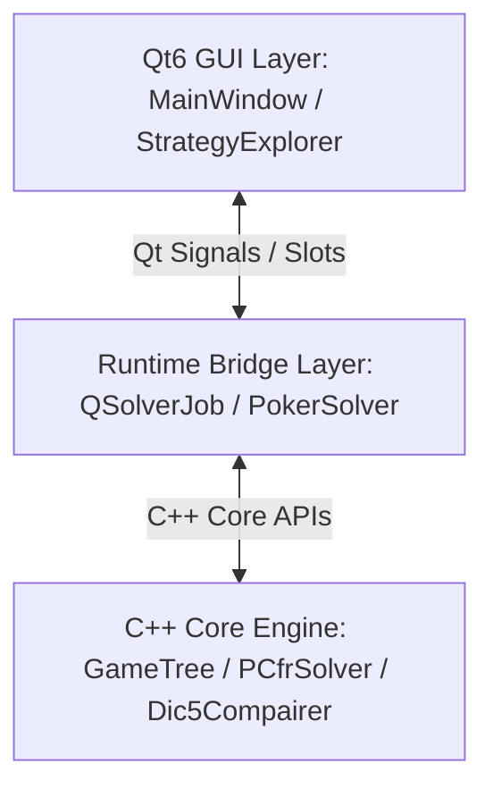
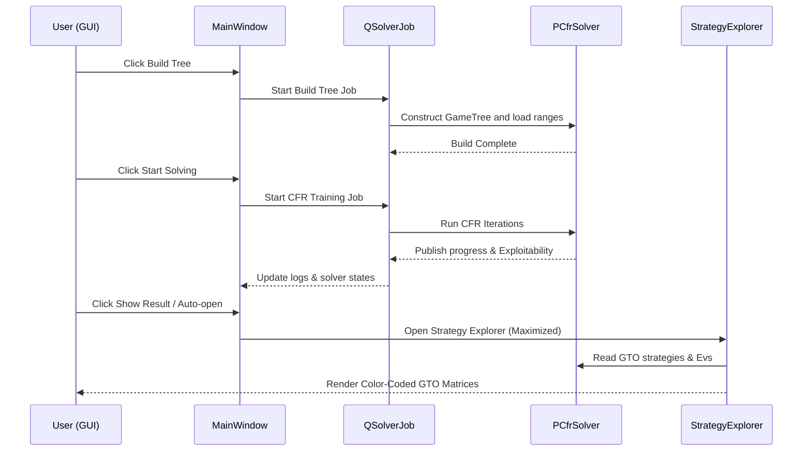

# TexasSolver Developer & Architecture Guide

Welcome, Developer/LLM! This document provides a comprehensive overview of the **TexasSolver** codebase. It outlines the architecture, data flows, core components, and recent major UI/UX and stability enhancements. Use this guide to quickly understand the project layout, design patterns, and logic relationships.

---

## 1. High-Level Architecture Overview

TexasSolver is a high-performance Texas Hold'em/Shortdeck GTO (Game Theory Optimal) solver written in C++ with a Qt6-based Graphical User Interface.

The application is structured into three main layers:

1. **C++ Core Engine (`src/`, `include/`)**: Implements game tree construction, rapid hand evaluation, range compilation, and Counterfactual Regret Minimization (CFR/CFR+) algorithms.
2. **Runtime Bridge Layer (`qsolverjob.h/cpp`)**: Runs the solver computations on a background thread (`QThread`) so the UI main loop remains completely responsive.
3. **Qt6 GUI Layer (`mainwindow.h/cpp`, `strategyexplorer.h/cpp`)**: Provides inputs for configuring hands, visualizes ranges and equilibrium strategies, and provides interactive GTO strategy locking tools.

---

## 2. Core Backend Engine (C++ Core)

The backend performs the heavy mathematical computations required to solve incomplete information games.

### A. Card & Evaluator Logic
- **`Card.h/cpp` & `Deck.h/cpp`**: Represent cards as integers. Provides translation between human-readable strings (e.g. `Ac`, `Kh`) and internal bitwise card representations.
- **`Dic5Compairer` (`src/compairer/`)**: An optimized hand evaluator using custom lookup tables to rank 5, 6, and 7-card combinations in milliseconds.

### B. Game Tree Construction
- **`GameTree.h/cpp`**: Constructs the full decision tree.
- **`nodes/` (`GameTreeNode`, `ActionNode`, `ChanceNode`, `ShowdownNode`, `TerminalNode`)**: Implements the Composite pattern representing the nodes of the tree:
  - **`ActionNode`**: Decision points where a player can choose to Check, Call, Fold, Bet, or Raise.
  - **`ChanceNode`**: Deal points for Flop, Turn, or River cards.
  - **`ShowdownNode` / `TerminalNode`**: Evaluation leaf nodes where payoffs are distributed.
- **`StreetSetting`**: Configures sizing profiles (bets/raises/donks) per street.

### C. Solver Algorithms
- **`PCfrSolver.h/cpp`**: The primary Counterfactual Regret Minimization engine. Supports running multi-threaded GTO solvers on Hold'em and Shortdeck games using CFR and CFR+ variants.
- **`BestResponse.h/cpp`**: Computes the optimal exploitability strategy against a given opponent strategy, allowing the engine to calculate exact Nash equilibrium convergence parameters.

---

## 3. Runtime & Bridging Model

To bridge the C++ engine with the Qt event loop:
- **`QSolverJob` (`include/runtime/qsolverjob.h`)**: A subclass of `QThread`. It holds the active `Solver` instance and delegates commands (e.g. `BUILDTREE`, `SOLVING`, `SAVING`, `LOADING`) to the engine.
- Communication is entirely asynchronous: the GUI starts the job, and the thread publishes progress and log messages back via Qt slots/signals.

---

## 4. Qt GUI Layer & UX Design Patterns

The GUI is designed around the Model-View-Delegate architecture to render the dense multidimensional data of poker GTO solutions.

### A. Main Window (`mainwindow.h/cpp`)
- Configures player ranges (using 13x13 matrices), board cards, and sizing rules.
- Contains the buttons to click **Build Tree** and **Start solving**.
- Shows system diagnostics, hardware thread recommendations, and RAM capacity analysis before building the tree.

### B. Strategy Explorer (`strategyexplorer.h/cpp`)
The primary GTO results browser. It contains:
1. **Rough Strategy View** (top): Displays overall action frequency percentages for the current node.
2. **Strategy Grid** (left): Interactive 13x13 range matrix. Shows action frequencies as color-coded bars in each cell.
3. **Lock Editor** (bottom-right): Vertical sliders representing frequencies for each action. Used to customize strategy rules for specific hands.
4. **Combos Detail View** (right): List of individual card combinations (e.g. `AsKs`, `AhKh`) displaying GTO frequencies, Evs, and weights.

### C. Custom Models & Delegates
- **`TableStrategyModel` / `DetailViewerModel` / `RoughStrategyViewerModel`**: Convert the raw C++ solver tree outputs into standard `QAbstractTableModel` feeds.
- **`StrategyItemDelegate` / `DetailItemDelegate`**: Perform custom cells painting. They draw proportional GTO color bands (e.g., green for check/call, red for bet/raise, blue for fold) and overlay text cleanly.

---

## 5. Key Architecture Enhancements (Recent Implementation Highlights)

Below are the major modern features, stability improvements, and UI refinements implemented in the codebase:

### A. Strategy Painter Tool (Interactive Edit Brush)
- **Problem**: Manually selecting and locking individual hands in the grid using sliders was slow.
- **Solution**: Implemented a "Painter Mode". Clicking the `🖌️ Painter` button activates brush state (`painterModeActive`):
  - The mouse cursor turns into a crosshair (`+`) when hovering over range/combo cells.
  - Clicking any hand cell in the grid instantly locks its combos to the configured slider frequencies (turns the cell background red).
  - Clicking any already locked cell erases the lock (restores normal solver values).
  - Clicking items in the combos details panel locks individual combos (e.g. locking only `AdKd` but leaving `AsKs` unlocked).

### B. Dynamic Solving Status & Exploitability Indicator
- **Problem**: Exploitability (the accuracy of the GTO solution) was only visible in the raw log scrollback in the main window.
- **Solution**: Added a status bar in the top-right of the Board layout in the Strategy Explorer:
  - Updates at 1Hz using a polling timer.
  - Displays state: `🟢 Solving... Expl: 1.25%`, `🟡 Building Tree...`, or `⚪ Stopped Expl: 0.12%`.
  - Directly queries `solver->last_exploitability` to pull the GTO convergence value in real time.

### C. Pot Percentage & Stack Commit Calculations
- **Problem**: Bet/raise options were labeled only as absolute chip amounts (e.g., `BET 6.0`), forcing users to compute pot ratios manually.
- **Solution**: Added recursive parent-node traversal to reconstruct street pots and compute bet sizing percentages relative to the pot.
  - Dynamically calculates: `BET 2.0 (50%)` or `RAISE 6.0 (50%, All-in)`.
  - Marks options as `All-in` automatically if the bet amount commits the player's remaining effective stack.

### D. Editable Slider Inputs (QDoubleSpinBox Integration)
- **Problem**: Dragging small vertical sliders made it difficult to set precise strategy frequencies (e.g., exactly `33%` check, `67%` bet).
- **Solution**: Embedded `QDoubleSpinBox` inputs beneath each slider.
  - Supports entering manual frequencies from `0.00` to `1.00`.
  - Recalculates and adjusts adjacent sliders proportionally using ratio-normalization so that the total sum of frequencies always equals `1.0`.
  - Synced two-way binding: moving a slider updates its spinbox, and editing a spinbox updates its slider.

### E. Layout Optimization & Responsive Stretch
- **Problem**: Detail cells inside the combos list was occasionally clipped or truncated if the window size was altered.
- **Solution**: Refactored the layouts with Qt Stretch factors:
  - **Rough Strategy** (top-right) has a fixed height of `50px` (stretch 0) to avoid wasted vertical space.
  - **Bottom Container** (Grid, Lock Editor, Sliders, Details) has stretch 1.
  - **Details View** (`detailView`) has auto-sizing rows but enforces a **minimum row height of 105px** to guarantee readability, adding a scrollbar when space is constrained.

### F. Window Maximization & Crash Stability Hooks
- **Problem 1**: Windows started in a small widget shape on Linux window managers (X11/Wayland), ignoring maximization attempts because the window was mapped before being displayed.
- **Solution 1**: Implemented delayed maximization. Placing `QTimer::singleShot(100)` callbacks in `MainWindow` and `StrategyExplorer` allows the OS window manager to register the windows first before maximizing them.
- **Problem 2**: Modifying tree parameters or clicking "Clear All" in the main window while Strategy Explorer was open triggered segmentation faults, because Strategy Explorer held dangling references to the old C++ game tree.
- **Solution 2**: Added synchronous teardown hooks. Clicking **Build Tree** or **Clear All** now immediately closes and deletes the open Strategy Explorer instance (`delete this->strategyExplorer;`), resetting reference pointers and preventing stale lookups.

### G. Interactive GTO Grid Cell & Combo Detail Tooltips
- **Problem**: When looking at the 13x13 grid or the bottom-right combos list, it was difficult to see the exact GTO strategy percentage numbers and EVs for a starting hand or specific suit combination without reading the small text of the selected cell.
- **Solution**: Implemented `Qt::ToolTipRole` support directly in `TableStrategyModel::data()` (for the 13x13 grid) and `DetailViewerModel::data()` (for the bottom-right combo detail list).
  - Hovering over a 13x13 grid cell shows average range weight/probability, GTO frequencies, action EVs, and average EV for that starting hand.
  - Hovering over a specific combo cell in the bottom-right detail list displays details for that exact combination (e.g. `AcKc`), its specific weight/probability, precise GTO frequencies, action EVs, and average EV for that suit combo.

### 8. Safe Widget Deletion in `clearLayout` to Prevent Crash on Button Click

**File**: [gtotrainerwindow.cpp](file:///home/shire/Programs/TexasSolver/gtotrainerwindow.cpp#L1393-L1406)

When the user clicked "Submit Strategy Check ✔️", `onSubmitRangeStrategy()` was triggered. This function called `clearLayout(ui->actionButtonsLayout)`, which immediately called `delete` on the button widget. Since the button widget was the sender of the executing slot, deleting it directly caused a segmentation fault when execution returned to Qt's internal message-handling code.

We fixed this by:
- Changing widget deletion inside `clearLayout` from direct `delete item->widget();` to `item->widget()->hide(); item->widget()->deleteLater();`.
- This hides the widget immediately so there is no visual latency, but safely delays deletion until control returns to the event loop.

### 9. Correct Subtree Deal Mapping & Thread-Safe `getTrainable` Concurrent Access

**Files**:
- [ActionNode.cpp](file:///home/shire/Programs/TexasSolver/src/nodes/ActionNode.cpp#L40-L46)
- [PCfrSolver.cpp](file:///home/shire/Programs/TexasSolver/src/solver/PCfrSolver.cpp)

**Problem**: 
- During CFR training, OpenMP uses multiple background threads to traverse different deal branches in parallel. When we previously added dynamic `vector::resize()` inside `ActionNode::getTrainable()` to guard against out-of-bounds checks, multiple threads began executing `resize()` concurrently. This triggered a thread-safety data race on the shared vector allocation, corrupting the heap metadata and causing random runtime crashes (`malloc(): unaligned tcache chunk detected` and `free(): invalid pointer`).
- The out-of-bounds index occurred in the first place because when running GTO Trainer on subtrees (e.g. Turn-to-River subtrees), the solver starts solving from `TURN` (meaning River nodes only pre-allocate `53` trainables). However, since the entire game tree started at `FLOP`, `getChanceCardsAtNode` returned both the turn and river cards (2 cards). `PCfrSolver` then calculated a full-tree deal index (e.g., `121`) which was out-of-bounds of the subtree's `53` pre-allocated trainable objects.

**Solution**:
- **Sliced Chance Cards by expected round depth**: Sliced the `chance_cards` array in `PCfrSolver::get_strategy()`, `get_evs()`, and `get_trainable()` to only include the number of chance cards expected based on the solver's root round (`expected = current_node_round - root_round`). This aligns deal indexes with the pre-allocated trainable sizes for both full-tree solvers and subtree solvers.
- **Reverted Thread-Unsafe Resizing**: Reverted `this->trainables.resize(...)` inside `ActionNode::getTrainable()`. The vector is now back to accessing pre-allocated elements by index. Because OpenMP threads only read/write to their own private deal index locations inside a pre-allocated vector without modifying vector size/capacity, concurrent access is now completely data-race free and thread-safe.

## What Was Tested

- **Compilation**: `make -C build -j$(nproc)` completed successfully with no errors.
- **Verification**: Built and verified the project compiles cleanly and runs safely. Thread-safety issues are resolved by removing runtime modifications to shared vector sizes, and sub-solver range explorer and trainer are aligned.

---

## 6. How Data Flows: Config to Visualization

Understanding this pipeline is key to analyzing or extending the codebase:

---

## 7. Developer/LLM Quick-start Checklist

If you are inspecting or modifying this codebase:
- **Game Logic Modifications**: If you are modifying betting rules, hand evaluator code, or CFR algorithms, your starting points are `src/GameTree.cpp`, `src/solver/PCfrSolver.cpp`, and `src/compairer/Dic5Compairer.cpp`.
- **UI Customization**: To modify layout or views, work in `strategyexplorer.cpp/ui` and the custom delegates (`src/ui/strategyitemdelegate.cpp`, `src/ui/detailitemdelegate.cpp`).
- **Memory Safety**: Always check if references to the solver are valid. If you add components that interact with the active tree, make sure they hook into the `destroyed` signal or clean up synchronously on tree reconstruction.
- **Translation / Multi-language support**: The app uses Qt translation files (`lang_en.ts`, `lang_cn.ts`). Update these when adding new text string variables.
